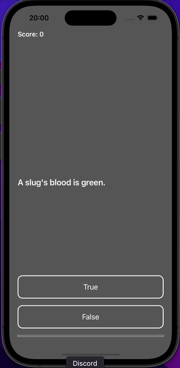

# SWIFT - MVC - App Simple Quiz

 

Project repository **Simple Quiz** development with **Swift, UIKit, MVC, Constraints, ViewCode, CocoaPods, Protocol Delegate**

<h3 id="acessar-projeto">📁 Preview</h3>

   &nbsp;&nbsp;&nbsp;&nbsp;&nbsp;&nbsp;&nbsp;&nbsp;&nbsp;&nbsp;&nbsp;&nbsp;&nbsp;&nbsp;&nbsp;&nbsp;&nbsp;&nbsp;
  &nbsp;&nbsp;&nbsp;&nbsp;&nbsp;&nbsp;&nbsp;
  

<h3 id="acessar-projeto">📁 Initializing Clone</h3>

◽ Clone the repository using Git Bash + the command:

       $ git clone git@github.com:IMatheusPiresI/swift-simple-quiz.git

<h3 id="sobre">📍 About</h3>

✅ Developed with **Swift, UIKit, MVC, Constraints, ViewCode, CocoaPods, Protocol Delegate**.  
✅ Project created for learning about MVC design pattern.

<h3 id="autor">✒️ Author</h3>

  
